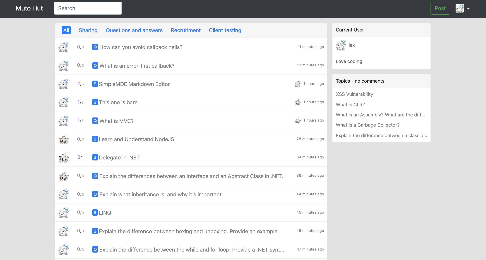
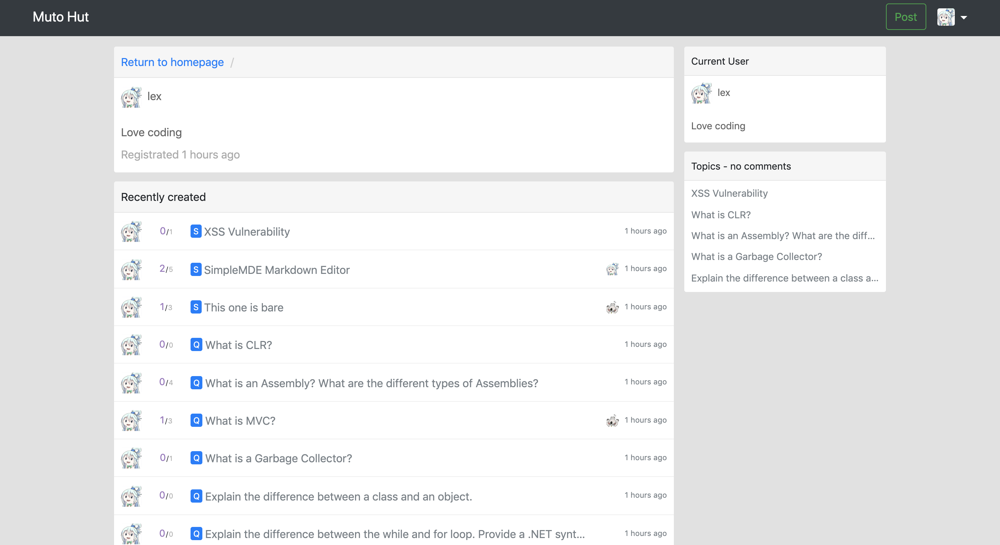
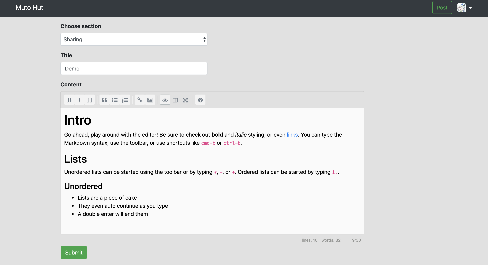
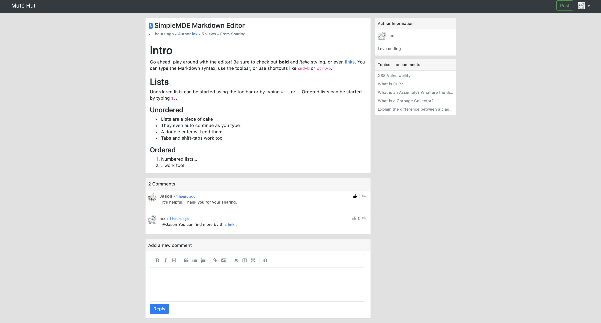
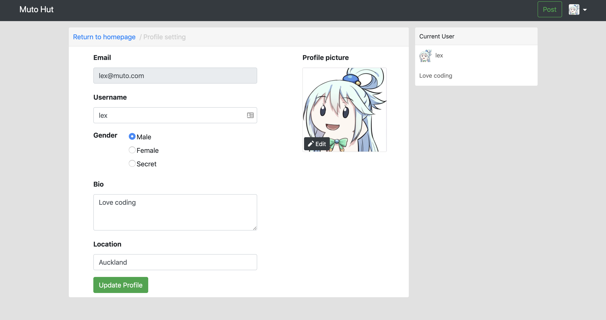
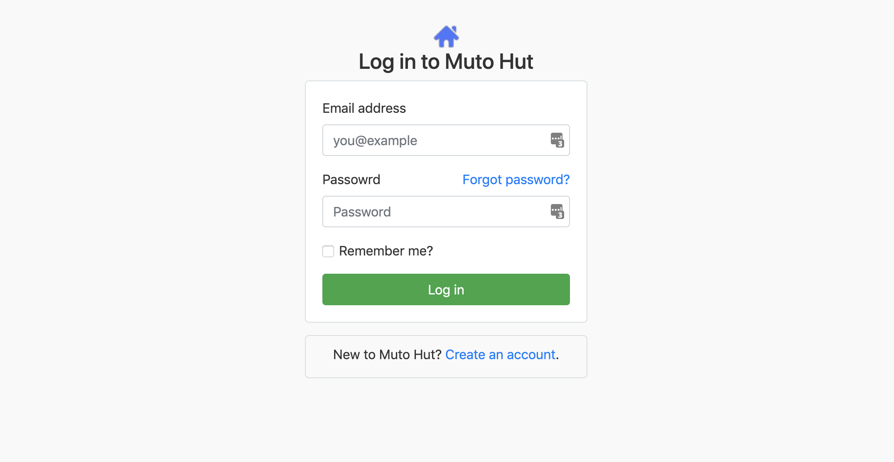

# Introduction

The purpose of this project is just for leanring nodeJs. I learnt more than just the nodeJS. Gernerally, this project was implemented based on nodeJS+expressJS+MongoDB. At this time, I didn't use any novel front-end frameworks like Reactjs or Angular. I just focussed on the implementation of the user interaction with help of Jquery (mainly Ajax).

# Project structure

```bash
.
|--controllers        ## actions 
|--models             ## mongoDB schema
|--node_modules       ## 3rd-party packages
|--public             ## Public static resources
|--views              ## All html views
|--routes             ## url route setting
|--README.md          ## Project description
|--app.js             ## Entry file
|--package.json
|--package-lock.json
```


# Route Table

##Basic router

| path              | method | params                          | login | remarks                            |
| ----------------- | ------ | ------------------------------- | ----- | ---------------------------------- |
| /                 |        | section, page, search           |       | Homepage                           |
| /settings/profile | GET    |                                 | x     | Personal page                      |
| /settings/profile | POST   | username, gender, bio, location | x     | Requests for updating user profile |
| /profile/avatar   | POST   | avatar(BINARY)                  | x     | Requests for uploading user avatar |

##User router

| path            | method | params                    | login | remarks                    |
| --------------- | ------ | ------------------------- | ----- | -------------------------- |
| /register       | GET    |                           |       | Page for registration      |
| /register       | POST   | email, nickname, password |       | Requests for registration  |
| /login          | GET    |                           |       | Page for login             |
| /login          | POST   | email, password           |       | Requests for login         |
| /logout         | GET    |                           | x     | Requests for logout        |
| /users/:user_id | GET    | user_id                   |       | Requests for personal page |

##Topic router

| path               | method | params                  | login | remarks                                 |
| ------------------ | ------ | ----------------------- | ----- | --------------------------------------- |
| /topics/new        | GET    |                         | x     | Page for new topic publish              |
| /topics/new        | POST   | section, title, content | x     | Requests for new topic                  |
| /topics/nocomments | GET    |                         |       | Requests for topics without any comment |
| /topics/:topic_id  | GET    | topic_id                |       | Requests for topic details              |

##Comment router

| path                                         | method | params                        | login | remarks                              |
| -------------------------------------------- | ------ | ----------------------------- | ----- | ------------------------------------ |
| /:topic_id/comment                           | POST   | topic_id, content             | x     | Requests for adding new comment      |
| /topic/:topic_id/comment/:comment_id/upcount | POST   | topic_id, comment_id          | x     | Requests for counting up one comment |
| /comment/:comment_id/reply                   | POST   | topic_id, comment_id, content | x     | Requests for replying one comment    |

# Technical detail

## User authentication 

[**Passport**](<http://www.passportjs.org/>) is authentication middleware for [Node.js](https://nodejs.org/). Extremely flexible and modular, Passport can be unobtrusively dropped in to any [Express](https://expressjs.com/)-based web application. A comprehensive set of strategies support authentication using a [username and password](http://www.passportjs.org/docs/username-password/), [Facebook](http://www.passportjs.org/docs/facebook/), [Twitter](http://www.passportjs.org/docs/twitter/), and [more](http://www.passportjs.org/packages/).

## File uploader

[**Multer**](<https://www.npmjs.com/package/multer>) is a node.js middleware for handling `multipart/form-data`, which is primarily used for uploading files. It is written on top of [busboy](https://github.com/mscdex/busboy) for maximum efficiency.

## Pagination

[**bootpag**](<http://botmonster.com/jquery-bootpag/#.XNJSTtMzaqQ>) - dynamic pagination jQuery plugin

## Markdown text

- [**Showdown**](<https://github.com/showdownjs/showdown>) is a Javascript Markdown to HTML converter, based on the original works by John Gruber. Showdown can be used client side (in the browser) or server side (with NodeJs). 

- [**SimpleMDE**](<https://simplemde.com/>) is a simple, embeddable, and beautiful JS markdown editor.

  - **[Moderate vulnerability](<https://github.com/sparksuite/simplemde-markdown-editor/issues/730>)** 

    This issue was found after pushing to github. Until now, this vulnerability is just fixed temporarily according to **roipoussiere's** comment.  Just in case, I will replace this markdown editor in the future.

# Project screenshot

## Homepage



## Personal page



##Post new topic



##Topic detail page



##User setting



##Login



## Registeration

